```{r setup, include=FALSE}
knitr::opts_chunk$set(echo = TRUE)
```

## Abstract

**Aim:** We aim to determine the drivers of avian diversity and their future changes, as this is of utmost importance for avian conservation. Different environmental drivers, such as climate, land-use and water availability can directly or indirectly affect biodiversity and are likely to act synergistically. Land-use and water availability strongly depend upon human population density, which makes the biodiversity in densely populated countries, such as Pakistan, particularly vulnerable to these changes.

**Location:** Pakistan

**Methods:** We extracted species ranges for birds occurring in Pakistan and identified environmental and land-use factors, which drive species richness of breeding and wintering birds using regression models. We then quantified the future change in these drivers and compared them among regions of low, medium, moderate and high species richness.

**Results:** Mean annual precipitation, urbanization and minimum river discharge explained more than 50% of variation in breeding bird richness and together with mean annual temperature explained around 40% of variation in wintering bird richness. Most bird species, both in the breeding and wintering season, were aggregated along the five main rivers, which are situated in the central and northern part of Pakistan. These areas will experience the largest reduction in precipitation in the future, while the change in temperature will be relatively small. In these regions, human population is also the highest and land-use is projected to undergo the highest increase in the future.

**Main conclusions:** Climate may affect distributions and thus avian richness in the future. On top of that, an increase in human population and land-use change will continue to cause changes in landscapes and habitats as well as the depletion of water resources. In Pakistan, both birds and humans aggregate in areas where water is available through rivers, which will lead to enormous pressure on bird richness in these areas in the future.

## Introduction

### Global climate change

see Frieler et al. 2017 - https://gmd.copernicus.org/articles/10/4321/2017/

### Global land-use change

see Frieler et al. 2017 - https://gmd.copernicus.org/articles/10/4321/2017/

### Bioenergy cropland expansion may offset positive effects of climate change mitigation

```{r, echo=F, out.width = "65%"}
knitr::include_graphics("https://www.pnas.org/cms/10.1073/pnas.1807745115/asset/a9a24534-73db-400d-beb0-2f24bb3ad900/assets/graphic/pnas.1807745115fig01.jpeg")
```

Hof et al. 2018 - https://www.pnas.org/doi/10.1073/pnas.1807745115

### Bridging local patterns with global challenges

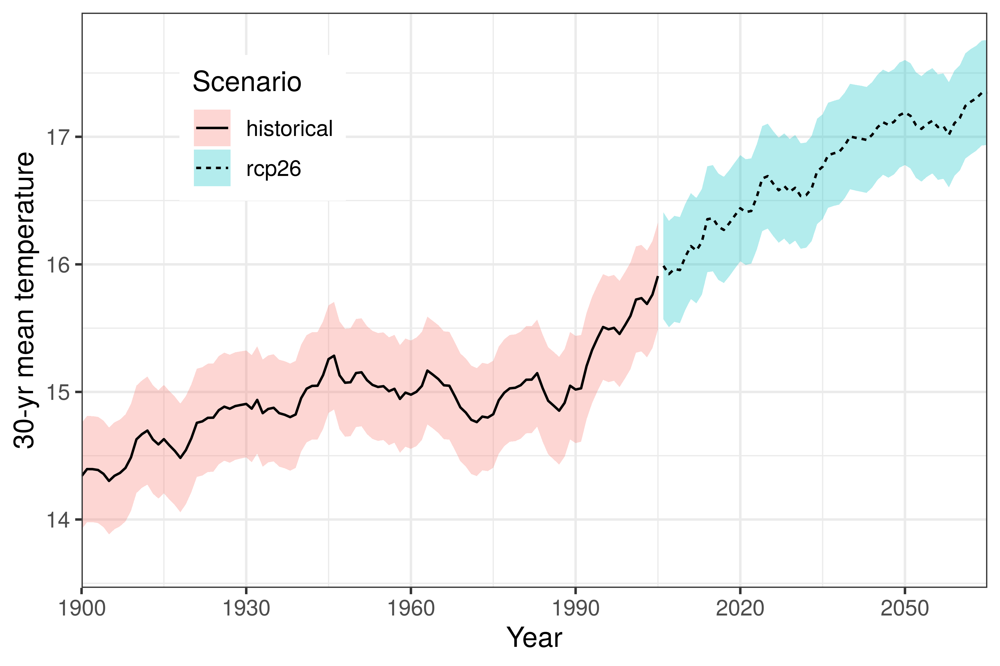

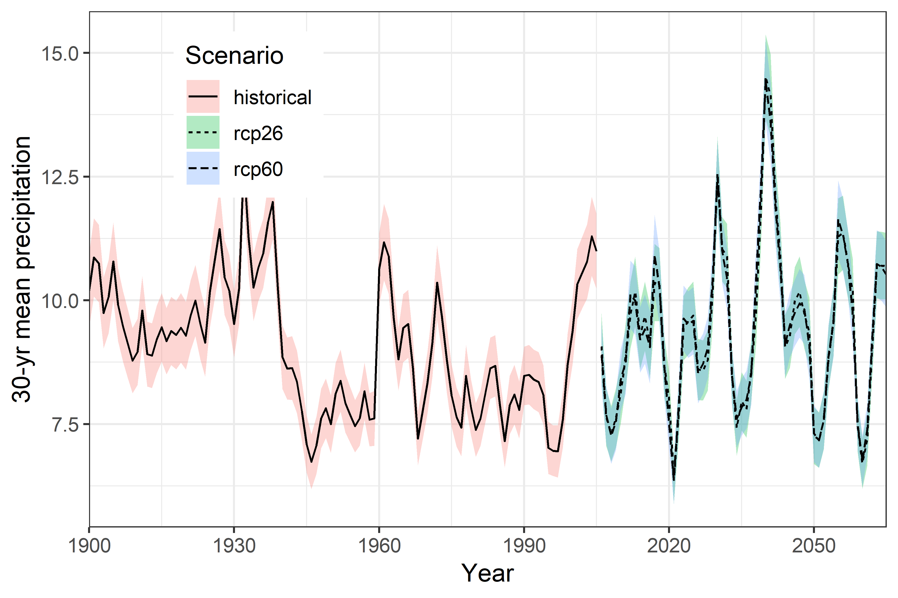

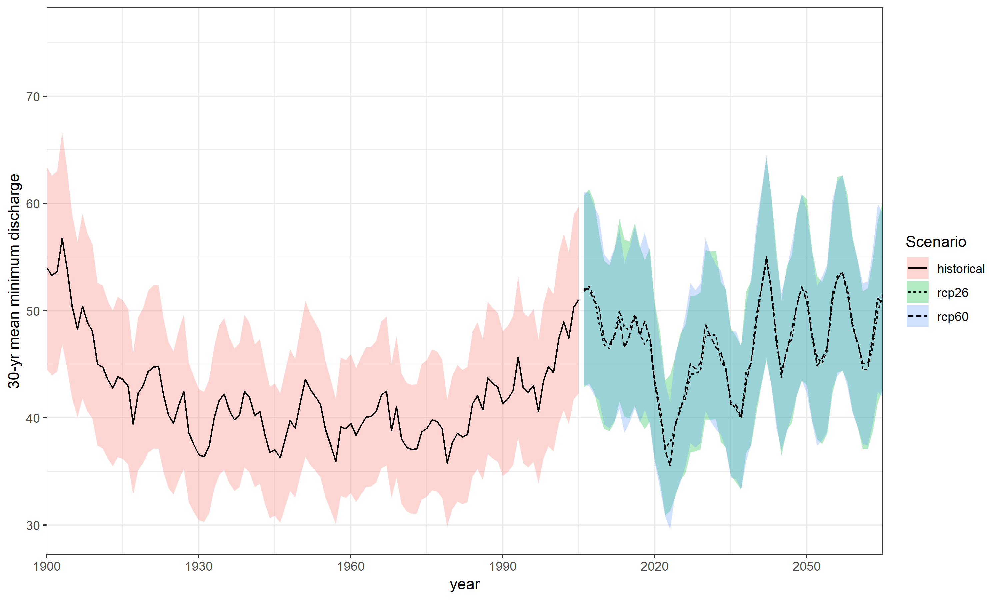

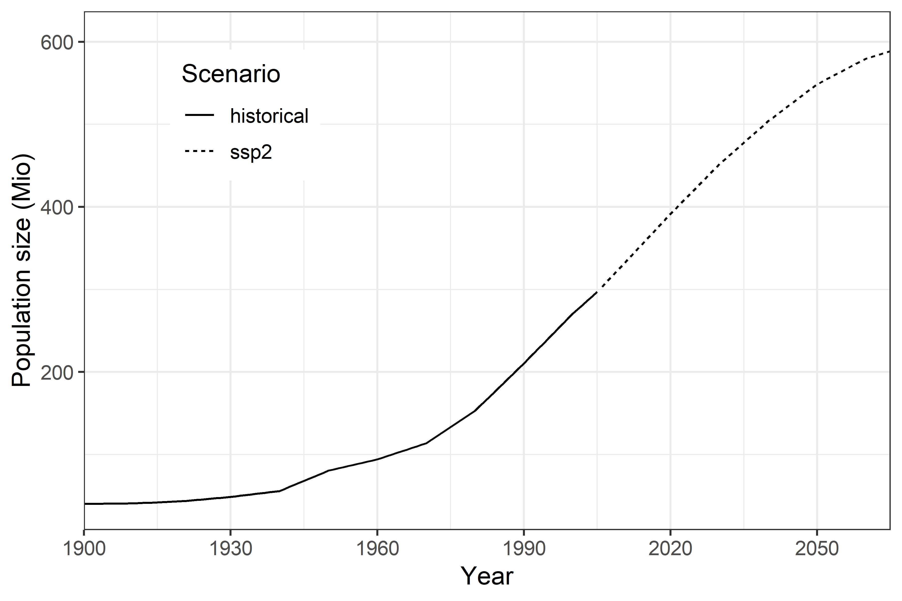

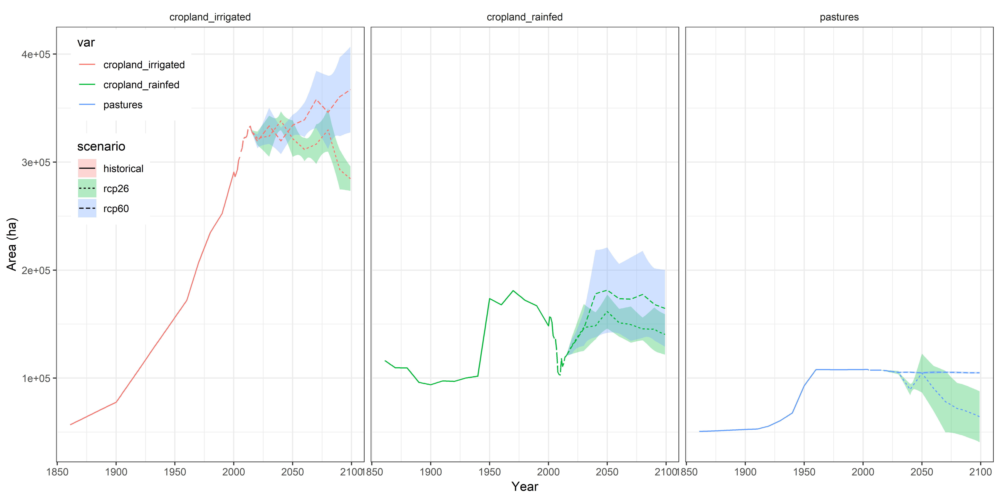

Countries like Pakistan are strongly affected by global changes, but the ecological impacts have been rarely studied.

**Aim:** To determine the drivers of avian diversity and their future changes in Pakistan

## Study area

Total area: 881,913 km^2^  
Water area: 2.86 %  
Population size: 203,439,146 (5^th^)  
Population density: 244.4/km 2 (56^th^)  
Elevation: 0 – 8611 m  

## Methods

### Species data

* Range maps of birds from Pakistan were obtained from Birdlife International and gridded to 0.5°
* The individual range maps were stacked for breeding and wintering birds separately according to the information provided with the shapefiles

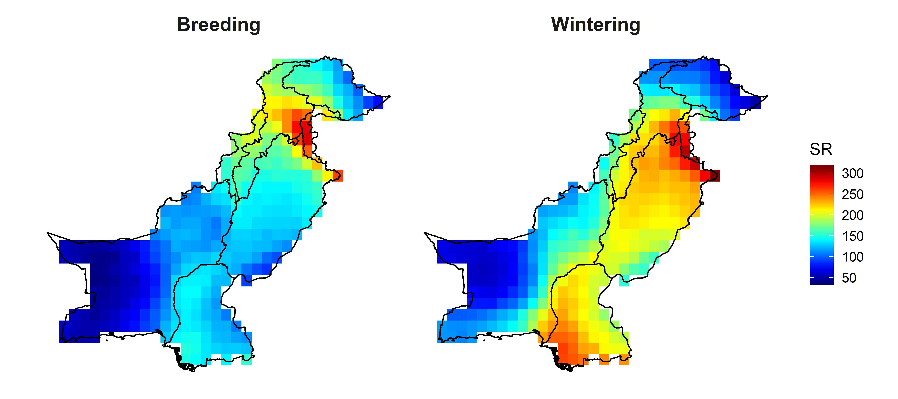

* Richness maps were then simplified by dividing the richness value into richness quartiles (low, medium, moderate and high)

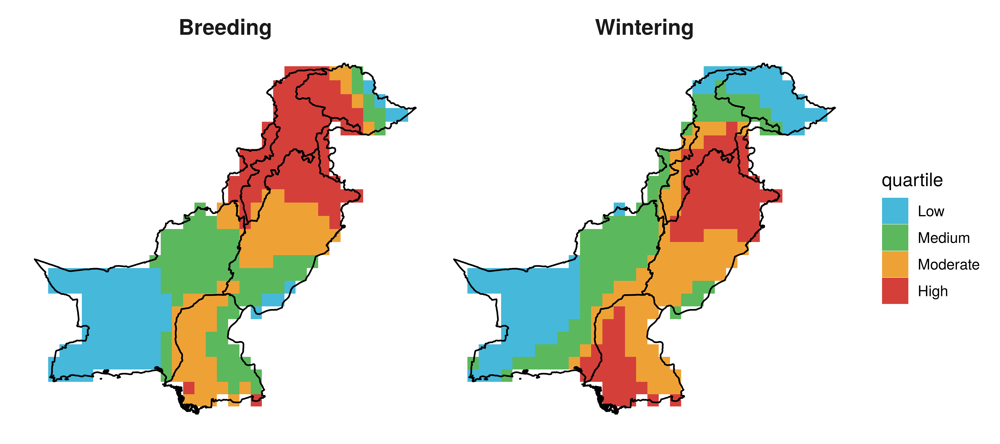

<!-- Add quartile maps with wide format!!! -->

### Environmental data

* EWEMBI observed climate data (0.5°, Lange 2017): 
  + Temperature (temp) and precipitation (prec), 1980 –2010
* ISIMIP2b historical and future simulations (0.5°, Frieler et al. 2017)
  + 3 GCMs (GFDL-ESM2M, IPSL-CM5A-LR, MIROC5)
  + RCP6.0 & SSP2
    + Temperature and precipitation
    + Minimum discharge (MPI-HM)
    + Land-use (cropland rainfed, cropland irrigated, and pastures)
    + Population (Hyde3.2)

### Regression models

* Model procedure
  + Removal of collinear variables (P >= 0.7)
  + Multiple linear regression
  + Step-wise selection procedure using AIC
* Sensitivity
  + Identify relative contribution of variables to explained variance
* Exposure
  + Future changes in variables

## Results

### Sensitivity

#### Final models

Season   | Richness quartile | Final model
---------| ----------------- | ---------------
Breeding | Low | SR ~ temp + prec + cropland rainfed
Breeding | Medium | SR ~ cropland irrigated + cropland rainfed
Breeding | Moderate | SR ~ prec + minimum discharge
Breeding | High | SR ~ temp + prec + population + cropland rainfed + pastures
Wintering | Low | SR ~ temp + prec + population + pastures
Wintering | Medium | SR ~ temp + prec + minimum discharge + cropland rainfed + pastures
Wintering | Moderate | SR ~ population + cropland irrigated + cropland rainfed + pastures
Wintering | High | SR ~ temp + prec + cropland rainfed

#### Relative importance of explanatory variables for explaining breeding and wintering bird richness

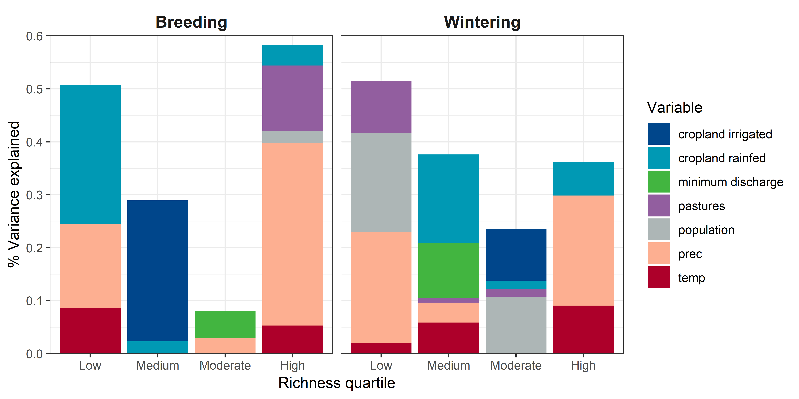

### Exposure

#### Temperature

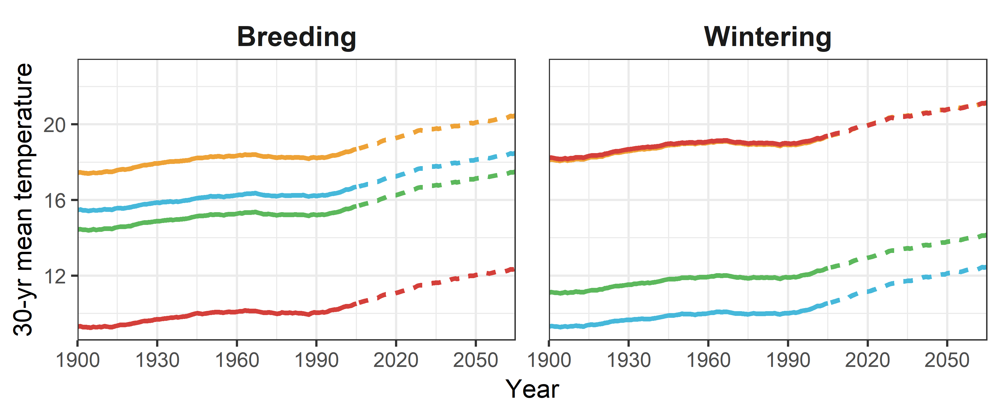

#### Precipitation

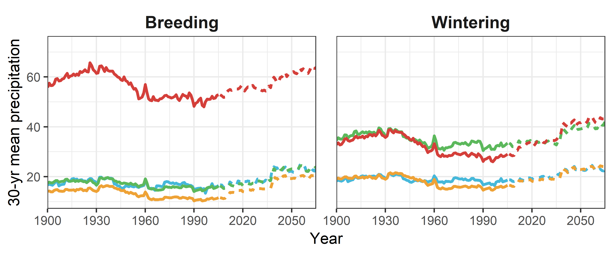

#### Minimum discharge

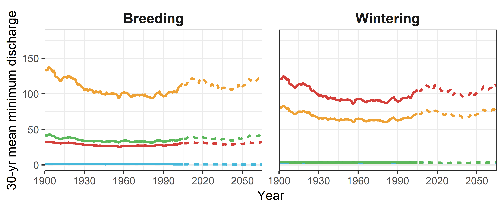

#### Population

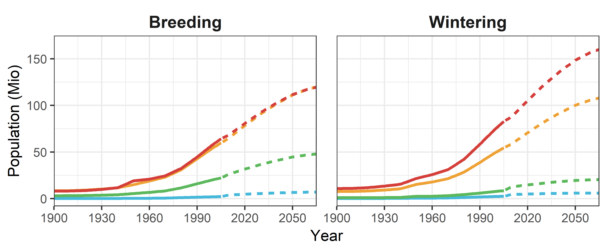

#### Land-use

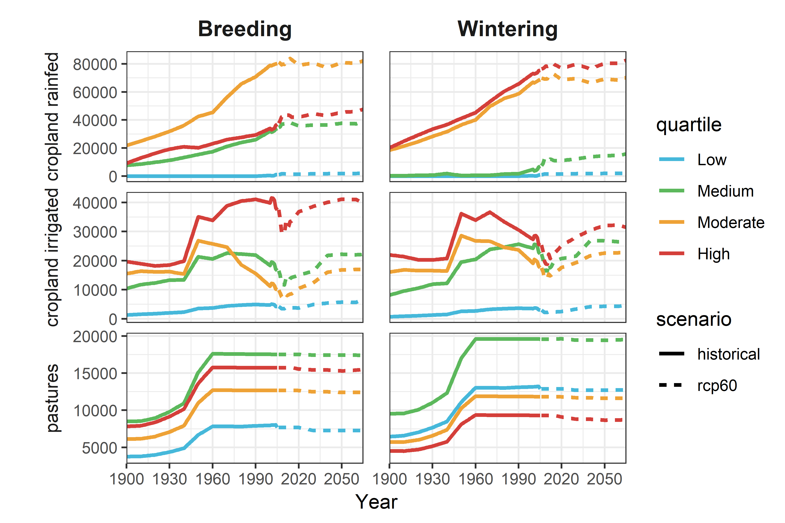

## Summary

* Depending on richness quartile we can explain more than 50% of variation in breeding and wintering bird richness
* Sensitivity to temperature, precipitation, discharge, land-use and population varied among quartiles and between breeding and wintering richness
* Exposure to changing conditions also varied among richness quartiles and between breeding and wintering richness
