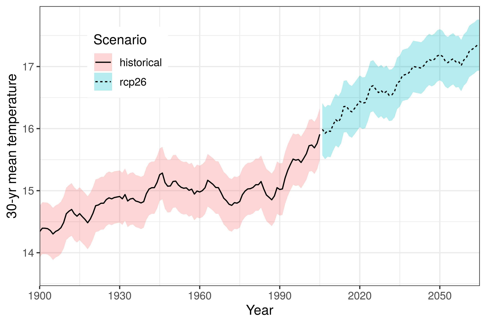
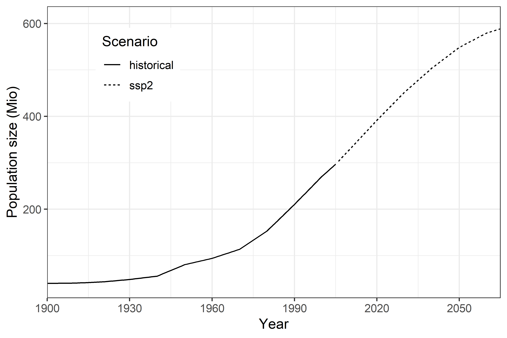
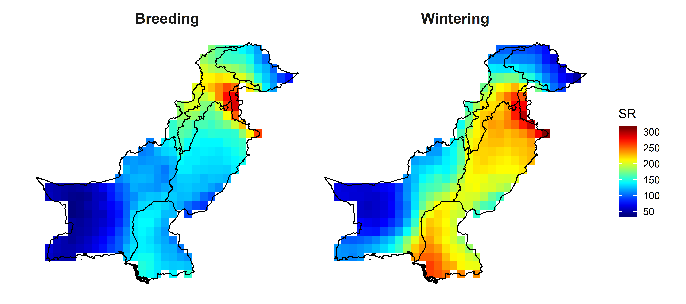
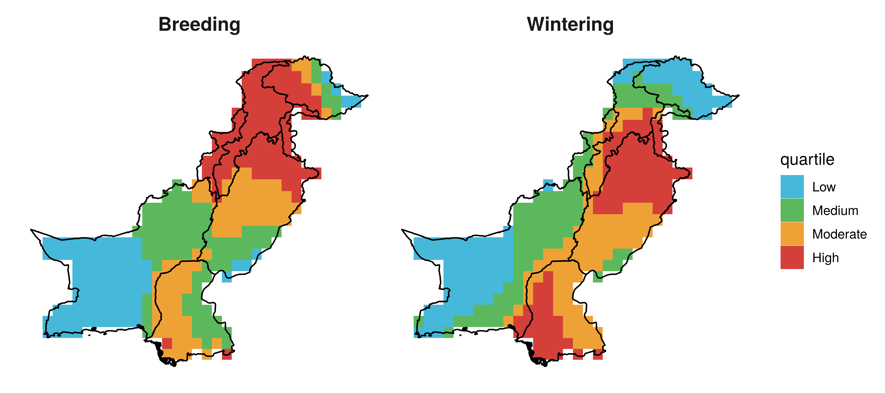
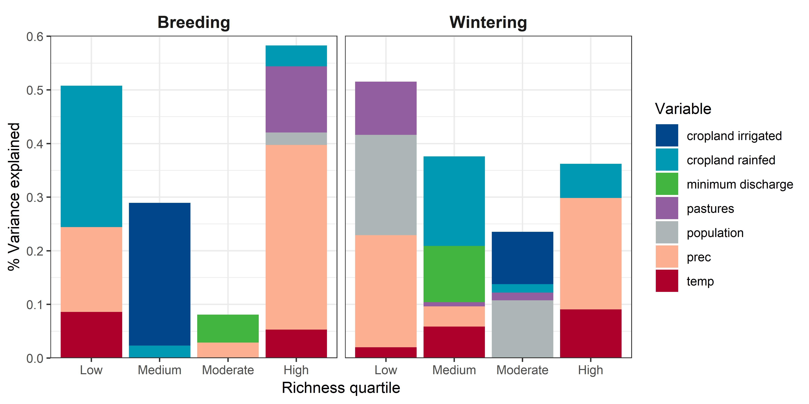
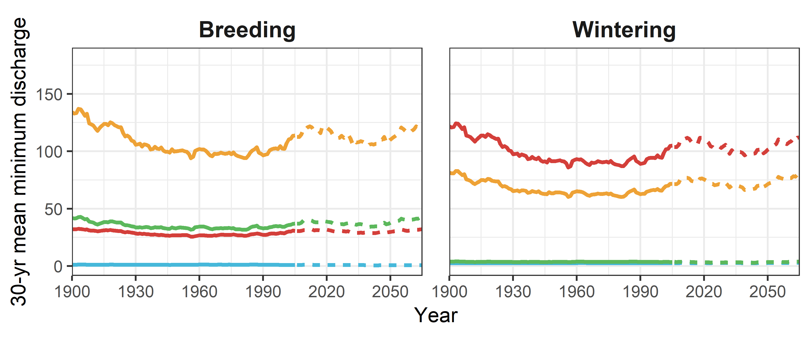

PakBirdSR - Future changes in drivers of avian diversity in Pakistan
================

## Abstract

**Aim:** We aim to determine the drivers of avian diversity and their
future changes, as this is of utmost importance for avian conservation.
Different environmental drivers, such as climate, land-use and water
availability can directly or indirectly affect biodiversity and are
likely to act synergistically. Land-use and water availability strongly
depend upon human population density, which makes the biodiversity in
densely populated countries, such as Pakistan, particularly vulnerable
to these changes.

**Location:** Pakistan

**Methods:** We extracted species ranges for birds occurring in Pakistan
and identified environmental and land-use factors, which drive species
richness of breeding and wintering birds using regression models. We
then quantified the future change in these drivers and compared them
among regions of low, medium, moderate and high species richness.

**Results:** Mean annual precipitation, urbanization and minimum river
discharge explained more than 50% of variation in breeding bird richness
and together with mean annual temperature explained around 40% of
variation in wintering bird richness. Most bird species, both in the
breeding and wintering season, were aggregated along the five main
rivers, which are situated in the central and northern part of Pakistan.
These areas will experience the largest reduction in precipitation in
the future, while the change in temperature will be relatively small. In
these regions, human population is also the highest and land-use is
projected to undergo the highest increase in the future.

**Main conclusions:** Climate may affect distributions and thus avian
richness in the future. On top of that, an increase in human population
and land-use change will continue to cause changes in landscapes and
habitats as well as the depletion of water resources. In Pakistan, both
birds and humans aggregate in areas where water is available through
rivers, which will lead to enormous pressure on bird richness in these
areas in the future.

## Introduction

### Global climate change

see Frieler et al. 2017 -
<https://gmd.copernicus.org/articles/10/4321/2017/>

### Global land-use change

see Frieler et al. 2017 -
<https://gmd.copernicus.org/articles/10/4321/2017/>

### Bioenergy cropland expansion may offset positive effects of climate change mitigation

Hof et al. 2018 - <https://www.pnas.org/doi/10.1073/pnas.1807745115>

### Bridging local patterns with global challenges

Countries like Pakistan are strongly affected by global changes, but the
ecological impacts have been rarely studied.

**Aim:** To determine the drivers of avian diversity and their future
changes in Pakistan

## Study area

Total area: 881,913 km2  
Water area: 2.86 %  
Population size: 203,439,146 (5th)  
Population density: 244.4/km 2 (56th)  
Elevation: 0 – 8611 m

## Methods

### Species data

- Range maps of birds from Pakistan were obtained from Birdlife
  International and gridded to 0.5°
- The individual range maps were stacked for breeding and wintering
  birds separately according to the information provided with the
  shapefiles

- Richness maps were then simplified by dividing the richness value into
  richness quartiles (low, medium, moderate and high)

<!-- Add quartile maps with wide format!!! -->

### Environmental data

- EWEMBI observed climate data (0.5°, Lange 2017):
  - Temperature (temp) and precipitation (prec), 1980 –2010
- ISIMIP2b historical and future simulations (0.5°, Frieler et al. 2017)
  - 3 GCMs (GFDL-ESM2M, IPSL-CM5A-LR, MIROC5)
  - RCP6.0 & SSP2
    - Temperature and precipitation
    - Minimum discharge (MPI-HM)
    - Land-use (cropland rainfed, cropland irrigated, and pastures)
    - Population (Hyde3.2)

### Regression models

- Model procedure
  - Removal of collinear variables (P \>= 0.7)
  - Multiple linear regression
  - Step-wise selection procedure using AIC
- Sensitivity
  - Identify relative contribution of variables to explained variance
- Exposure
  - Future changes in variables

## Results

### Sensitivity

#### Final models

| Season    | Richness quartile | Final model                                                         |
|-----------|-------------------|---------------------------------------------------------------------|
| Breeding  | Low               | SR \~ temp + prec + cropland rainfed                                |
| Breeding  | Medium            | SR \~ cropland irrigated + cropland rainfed                         |
| Breeding  | Moderate          | SR \~ prec + minimum discharge                                      |
| Breeding  | High              | SR \~ temp + prec + population + cropland rainfed + pastures        |
| Wintering | Low               | SR \~ temp + prec + population + pastures                           |
| Wintering | Medium            | SR \~ temp + prec + minimum discharge + cropland rainfed + pastures |
| Wintering | Moderate          | SR \~ population + cropland irrigated + cropland rainfed + pastures |
| Wintering | High              | SR \~ temp + prec + cropland rainfed                                |

#### Relative importance of explanatory variables for explaining breeding and wintering bird richness

### Exposure

#### Temperature

#### Precipitation

#### Minimum discharge

#### Population

#### Land-use

## Summary

- Depending on richness quartile we can explain more than 50% of
  variation in breeding and wintering bird richness
- Sensitivity to temperature, precipitation, discharge, land-use and
  population varied among quartiles and between breeding and wintering
  richness
- Exposure to changing conditions also varied among richness quartiles
  and between breeding and wintering richness
